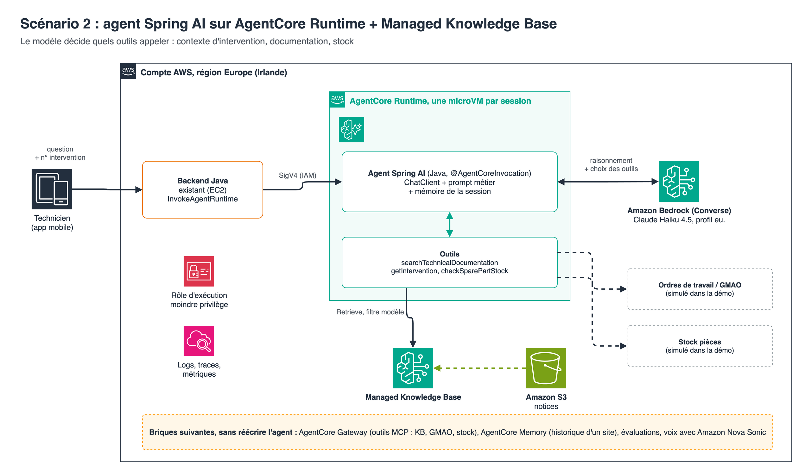

# Agent technicien : Spring AI sur Amazon Bedrock AgentCore Runtime + Managed Knowledge Base (Java)

Démonstrateur d'un agent qui assiste un technicien de maintenance en intervention. L'agent récupère le contexte de l'intervention, cherche dans la documentation technique des fabricants, vérifie le stock de pièces, puis répond, uniquement à partir de ce que ses outils lui ont renvoyé.

C'est le **scénario 2 : agent**. Le scénario 1 (appel LLM classique) est dans le dépôt `bedrock-managed-kb-rag-java`.



## Comment ça marche

- L'agent est une application **Spring Boot + Spring AI** (Java). L'annotation `@AgentCoreInvocation` du [Spring AI AgentCore SDK](https://github.com/spring-ai-community/spring-ai-agentcore) expose le contrat attendu par AgentCore Runtime (`POST /invocations`, `GET /ping`). Le même jar tourne en local.
- Il est hébergé sur **AgentCore Runtime** : une microVM isolée par session, mise à l'échelle automatique, facturation à la consommation. D'après la [page de tarification](https://aws.amazon.com/bedrock/agentcore/pricing/), le CPU n'est pas facturé pendant l'attente des réponses du modèle ou des outils.
- Le modèle (Claude Haiku 4.5 via le profil d'inférence `eu.`) choisit ses outils :

| Outil | Rôle | Dans la démo |
|---|---|---|
| `getIntervention` | Contexte de l'ordre de travail : site, fabricant, modèle exact, historique des pannes | Données simulées |
| `searchTechnicalDocumentation` | `Retrieve` sur la Managed Knowledge Base, filtré sur le modèle | Réel |
| `checkSparePartStock` | Disponibilité d'une pièce au dépôt | Données simulées |

- Une mémoire de conversation courte, clé = identifiant de session AgentCore, permet d'enchaîner les questions sur une même intervention.
- La réponse contient la liste des outils appelés et des documents consultés, pour la démo et le débogage.

Les outils simulés représentent les systèmes existants (GMAO, stock). En production, chaque méthode appelle l'API réelle, ou devient une cible **AgentCore Gateway** exposée en MCP, sans changer le code de l'agent. La Managed Knowledge Base peut elle-même être exposée comme outil via [AgentCore Gateway](https://docs.aws.amazon.com/bedrock/latest/userguide/kb-gateway-target.html).

### Recherche dans une Knowledge Base managée

Une Knowledge Base managée s'interroge avec `Retrieve` et le paramètre `managedSearchConfiguration`. Le paramètre `vectorSearchConfiguration` est celui des Knowledge Bases vectorielles. Voir `TechnicalDocumentationTools`.

## Prérequis

- Compte AWS, région `eu-west-1`, accès au modèle Claude Haiku 4.5 activé dans Amazon Bedrock
- AWS CLI v2, `jq`, Docker ou Finch (image ARM64)
- Java 21 ou plus (testé en 21, compatible 25), Maven 3.9

## Déployer

```bash
./scripts/deploy.sh
```

Le script déploie le socle (bucket, Knowledge Base managée, dépôt ECR, rôle d'exécution), charge `sample-docs/`, lance l'indexation, construit et pousse l'image ARM64, puis crée le runtime AgentCore.

## Tester

Sur AgentCore Runtime (appel authentifié IAM SigV4) :

```bash
./scripts/invoke.sh "J'ai un code F28, que faire ?" INT-2026-0412
./scripts/invoke.sh "J'ai un code F28, que faire ?" INT-2026-0413
./scripts/invoke.sh "J'ai un code F28, que faire ?"
```

Même question, trois comportements :

- `INT-2026-0412` : chaudière Condensa 24, F28 = pression d'eau trop basse. L'historique montre deux remises en pression en un mois : l'agent doit orienter vers une fuite ou le vase d'expansion, et vérifier le stock du vase.
- `INT-2026-0413` : chaudière Ecoline 35, F28 = défaut d'allumage répété. Une autre panne, un autre diagnostic.
- Sans intervention : le code est ambigu, l'agent doit demander le modèle.

Pour enchaîner les questions dans la même session, réutiliser l'identifiant de session affiché :

```bash
./scripts/invoke.sh "Et quelle pression viser au remplissage ?" INT-2026-0412 <session-id>
```

En local :

```bash
export KNOWLEDGE_BASE_ID=...   # sortie KnowledgeBaseId du stack
mvn spring-boot:run
./scripts/ask-local.sh "J'ai un code F28, que faire ?" INT-2026-0412
```

## Tests

```bash
mvn test
```

Tests sans appel AWS : configuration de recherche managée et filtre par modèle, traçage des outils, outils simulés, démarrage du contexte Spring et enregistrement de l'agent.

## Documentation d'exemple

`sample-docs/` contient une documentation **fictive** (fabricants et modèles inventés) : deux chaudières gaz dont le code F28 n'a pas la même signification, une pompe à chaleur et une procédure de sécurité. Chaque document a un fichier `.metadata.json` utilisé pour le filtrage.

## Choix d'architecture (AWS Well-Architected)

| Pilier | Ce qui est en place |
|---|---|
| Sécurité | Appel du runtime authentifié IAM (SigV4). Rôle d'exécution limité à l'image ECR de l'agent, à la Knowledge Base et au profil d'inférence européen. Isolation par microVM et par session. Image non root, scannée au push, tags immuables. Bucket chiffré, accès public bloqué, TLS obligatoire. |
| Fiabilité | Runtime managé avec contrôle de santé (`/ping`), retries et timeouts explicites, infrastructure en CloudFormation. |
| Efficacité des performances | L'agent ne cherche que ce dont il a besoin, filtré sur le bon modèle d'équipement. Mise à l'échelle par session gérée par le service. |
| Optimisation des coûts | Pas de facturation CPU pendant l'attente du modèle, modèle léger par défaut (changeable via `MODEL_ID`), plafond de tokens, tokens renvoyés à chaque réponse. |
| Excellence opérationnelle | Logs structurés par invocation (outils appelés, documents, tokens, latence), traces et métriques AgentCore, déploiement scripté. |
| Durabilité | Aucune capacité réservée : les ressources suivent l'usage réel. |

## Avant la production

- **Authentification des techniciens** : AgentCore Runtime accepte aussi un jeton OAuth (JWT) de votre fournisseur d'identité, pour que l'identité du technicien arrive jusqu'à l'agent.
- **Garde-fous** : ajouter un contrôle de la sortie (Amazon Bedrock Guardrails) et un jeu d'évaluation rejoué à chaque changement de modèle ou de prompt.
- **Réseau** : mode VPC du runtime pour atteindre les systèmes internes (GMAO) en privé.
- **Mémoire durable** : AgentCore Memory pour conserver l'historique d'un site d'une intervention à l'autre.

## Supprimer les ressources

```bash
./scripts/destroy.sh
```

## Références

- [Spring AI SDK for Amazon Bedrock AgentCore is now Generally Available](https://aws.amazon.com/blogs/machine-learning/spring-ai-sdk-for-amazon-bedrock-agentcore-is-now-generally-available/)
- [Build enterprise search for agents with Amazon Bedrock Managed Knowledge Base](https://aws.amazon.com/blogs/machine-learning/build-enterprise-search-for-agents-with-amazon-bedrock-managed-knowledge-base/)
- [Connect to your knowledge base through AgentCore Gateway](https://docs.aws.amazon.com/bedrock/latest/userguide/kb-gateway-target.html)
- [IAM permissions for AgentCore Runtime](https://docs.aws.amazon.com/bedrock-agentcore/latest/devguide/runtime-permissions.html)
- [Tarification Amazon Bedrock AgentCore](https://aws.amazon.com/bedrock/agentcore/pricing/)
